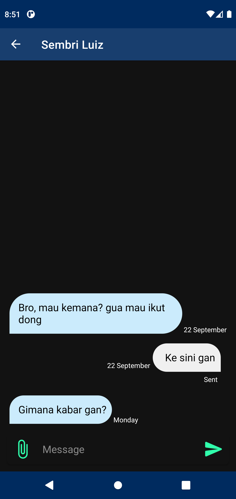

# Sms Classification

A simple Android SMS classification app that implement LSTM model on classifying Indonesian text messages that still under development. With this app you can:

* Receive and/or send text message.
* Classify incoming sms (real-time classification) using LSTM model into three classes (normal/personal, scam/fraud, promotions/advertisement).
* Move/change conversation label in case of misclassification.
* More features to come...

## Display
### Light Theme
#### Splash Screen and Start Screen
  
#### Conversation List, Messages List, Contact List, Settings
   
 

### Dark Theme
#### Splash Screen and Start Screen
  
#### Conversation List, Messages List, Contact List, Settings
   
 

## Library
* [Gson](https://github.com/google/gson/)
* [Coroutine](https://developer.android.com/kotlin/coroutines)
* [Glide](https://github.com/bumptech/glide/)
* [Jetpack-Navigation](https://developer.android.com/guide/navigation/navigation-getting-started)
* [Dagger-Hilt](https://developer.android.com/training/dependency-injection/hilt-android)
* [Room Presistence Library](https://developer.android.com/training/data-storage/room)
* [SMS-MMS Sending Library](https://github.com/klinker41/android-smsmms)
* [LibPhoneNumber-android](https://github.com/MichaelRocks/libphonenumber-android)
* [Turbine](https://github.com/cashapp/turbine)
* [TensorFlowLite](https://www.tensorflow.org/lite)
* [Roboletric](https://github.com/robolectric/robolectric)
* [Mockito](https://github.com/mockito/mockito)
* [Espresso](https://developer.android.com/training/testing/espresso)

## App Architecture
* MVVM
